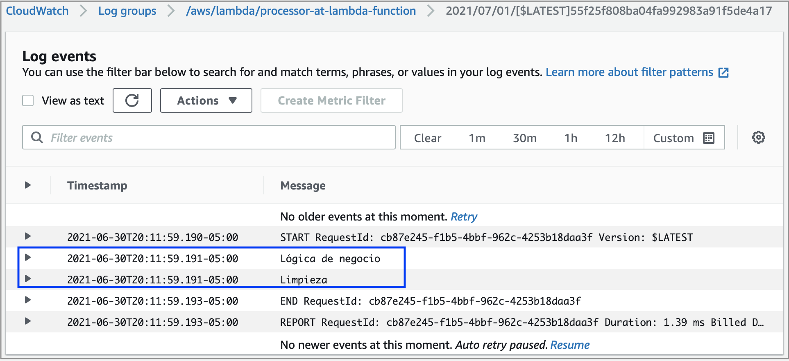

# Processor@Lambda
Código del artículo [El uso del patrón de diseño Processor en AWS Lambda.]()

## Unit Testing
Disponer de pruebas automatizadas es una práctica que abona a la calidad de una solución basada en software.
Un tipo de prueba automatizada son las pruebas unitarias. Este proyecto contiene una sola que se ejecuta con
el siguiente comando (se asume que **python3** está asociado a Python 3.8 o superior):
```
python3 -m unittest tests/processor.py
```
La salida será parecida a la que se muestra a continuación:
```
F
======================================================================
FAIL: test_it_works (tests.processor.TestProcessor)
----------------------------------------------------------------------
Traceback (most recent call last):
  File "/Users/lemoinf/Projects/blogs/processor-design-pattern-and-lambda/processor@lambda/tests/processor.py", line 5, in test_it_works
    self.fail('Prueba fallida intencionalmente')
AssertionError: Prueba fallida intencionalmente

----------------------------------------------------------------------
Ran 1 test in 0.001s

FAILED (failures=1)
```
Deliberadamente y para este proyecto, la prueba unitaria falla. Sin embargo, ilustra la propiedad principal de una prueba unitaria que es la de ejecutar y comprobar la lógica de negocio detrás de la función Lambda sin tener que hacer el despliegue a AWS para ejecutarla desde la consola (como es común encontrar que muchos desarrolladores lo hacen). Futuras aplicaciones del patrón de diseño Processor en funciones Lambda abordarán casos más complicados y pruebas unitarias más ilustrativas.

## Build and Deploy
Se ha creado el script `build-deploy.sh` para comprimir los archivos que componen la función Lambda, hacer el despliegue a AWS mediante una plantilla de [CloudFormation](https://aws.amazon.com/cloudformation/) y crear un *stack*
de nombre **processor-at-lambda-stack**. Para 
realizar el despliegue, basta con ejecutar:
```
cd ./build-deploy
./build-deploy.sh
```
Se asume que se tiene instalada y configurada la interfaz de la línea de comando para AWS ([AWS Command Line Interface](https://aws.amazon.com/cli/)).

En futuras ediciones de esta serie de artículos:

1. Se hará uso de servicios de AWS como [CodePipeline](https://aws.amazon.com/codepipeline/), [CodeBuild](https://aws.amazon.com/codebuild/) y [CodeDeploy](https://aws.amazon.com/codedeploy/).
2. Se cerrará el ciclo Build-Deploy-Test con pruebas automatizadas de integración. Una vez que se ha desplegado la función, es posible ejecutar el comando AWS CLI `aws lambda invoke --function-name processor-at-lambda-function response.json` para ver su efecto que, en este caso, solamente inscribe dos mensajes en [Amazon CloudWatch](https://aws.amazon.com/cloudwatch/) como se aprecia en la siguiente imagen:

Las pruebas automatizadas permiten determinar que la función hace aquello para lo que está diseñada y no tener que hacerlo a través de una inspección visual. Cuando un repositorio está involucrado (un log, una base de datos, etc.), se les conoce como pruebas de integración que serán cubiertas en futuros artículos de esta serie.
